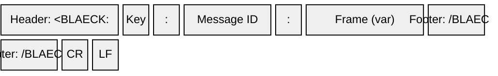

# Frame Format

Every Blaeck message is wrapped in a fixed binary envelope. The envelope is identical across all [frame types](frames) and all library versions.

| Part | Size | Description |
|------|------|-------------|
| Header | 8 bytes | ASCII `<BLAECK:` |
| Message Key | 1 byte | Identifies the [frame type](frames) |
| Separator | 1 byte | ASCII `:` |
| Message ID | 4 bytes | uint32 — see below |
| Separator | 1 byte | ASCII `:` |
| Frame | variable | Frame-specific payload — see [Frames](frames) |
| Footer | 8 bytes | ASCII `/BLAECK>` |
| EOT | 2 bytes | `\r\n` |

**Total overhead:** 25 bytes + frame.

## Byte Order

All multi-byte integers throughout the protocol are **little-endian**.

## Message ID

The Message ID is a uint32 value included in every frame. For request/response exchanges, the host provides a Message ID and the device **echoes it back**, allowing the host to correlate requests with responses.

For unsolicited frames (e.g., timed data streaming, restart notifications), the Message ID is application-defined.

