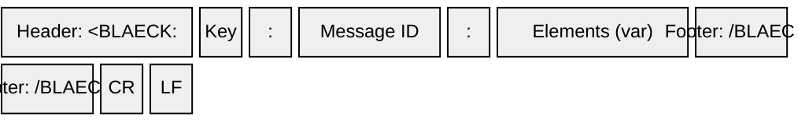

# Frame Format

Every Blaeck message is wrapped in a fixed binary envelope. The envelope is identical across all [frame types](frames) and all library versions.

## Structure



### Parts Table

| Part | Content | Size | Encoding |
|------|---------|------|----------|
| Header | `<BLAECK:` | 8 bytes | ASCII `3C 42 4C 41 45 43 4B 3A` |
| Message Key | Single byte (e.g. `0xD2`) | 1 byte | Binary |
| Separator | `:` | 1 byte | ASCII `0x3A` |
| Message ID | Monotonic counter | 4 bytes | uint32, little-endian |
| Separator | `:` | 1 byte | ASCII `0x3A` |
| Elements | Key-specific payload | variable | See [Frames](frames) |
| Footer | `/BLAECK>` | 8 bytes | ASCII `2F 42 4C 41 45 43 4B 3E` |
| EOT | `\r\n` | 2 bytes | ASCII `0x0D 0x0A` |

**Total overhead:** 25 bytes + elements.

## Byte Order

All multi-byte integers throughout the protocol are **little-endian**.

## Message ID

The Message ID is a uint32 value included in every frame. For request/response commands (e.g., `GET_DEVICES`, `WRITE_SYMBOLS`, `WRITE_DATA`), the host provides a Message ID in the command parameters and the device **echoes it back** in the response frame, allowing the host to correlate requests with responses.

For frames sent without a host request (e.g., timed data streaming, restart notifications), the Message ID is application-defined — typically `0x00000001` or a value set by the application.

## Example

A minimal frame with message key `0xD2`, Message ID `1`, and a 20-byte elements payload:

```
Offset  Hex                                          ASCII
------  -------------------------------------------  --------
0x00    3C 42 4C 41 45 43 4B 3A                      <BLAECK:
0x08    D2                                           .
0x09    3A                                           :
0x0A    01 00 00 00                                  ....
0x0E    3A                                           :
0x0F    [20 bytes of elements]                       ........
0x23    2F 42 4C 41 45 43 4B 3E                      /BLAECK>
0x2B    0D 0A                                        \r\n
```

See [Elements](elements) for the payload definitions and [Decoding Examples](decoding-examples) for fully annotated hex dumps.
