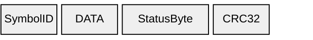
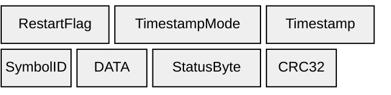
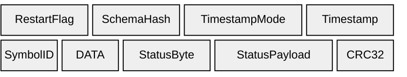

# Data

## B1 — Data (`0xB1`)

Data message without timestamps.

| Element | Size | Type | Notes |
|-------|------|------|-------|
| **SymbolID** | 2 bytes | uint16 | |
| **DATA** | variable | Per [DTYPE](../datatypes) | |
| StatusByte | 1 byte | uint8 | |
| CRC32 | 4 bytes | uint32 | Scope: MsgKey through last DATA byte (StatusByte **excluded**) |

---

## D1 — Data (`0xD1`)

Data message with 4-byte timestamps.

| Element | Size | Type | Notes |
|-------|------|------|-------|
| RestartFlag | 1 byte | uint8 | `0x01` on first frame after restart |
| TimestampMode | 1 byte | uint8 | `0` = none, `1` = micros, `2` = RTC/UNIX |
| Timestamp | 4 bytes | uint32 | **Conditional:** only if TimestampMode > 0 |
| **SymbolID** | 2 bytes | uint16 | |
| **DATA** | variable | Per [DTYPE](../datatypes) | |
| StatusByte | 1 byte | uint8 | |
| CRC32 | 4 bytes | uint32 | Scope: MsgKey through last DATA byte (StatusByte **excluded**) |

---

## D2 — Data (`0xD2`)

Data message with 8-byte timestamps, schema hash, and status payload.

| Element | Size | Type | Notes |
|-------|------|------|-------|
| RestartFlag | 1 byte | uint8 | `0x01` on first frame after restart |
| SchemaHash | 2 bytes | uint16 | [CRC16-CCITT](../schema-hash) over signal schema |
| TimestampMode | 1 byte | uint8 | `0` = none, `1` = micros, `2` = UNIX |
| Timestamp | 8 bytes | uint64 | **Conditional:** only present if TimestampMode > 0 |
| **SymbolID** | 2 bytes | uint16 | Signal index |
| **DATA** | variable | — | Value bytes, size per [datatype](../datatypes) |
| StatusByte | 1 byte | uint8 | [Status code](../status-codes) |
| StatusPayload | 4 bytes | — | Status-specific data |
| CRC32 | 4 bytes | uint32 | [CRC32](../crc32) over MsgKey through StatusPayload |

See [Timestamps](../timestamps) for timestamp modes, [Status Codes](../status-codes) for status values, and [CRC32](../crc32) for the checksum algorithm.
