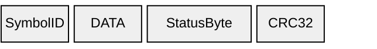
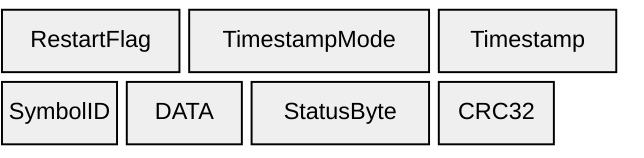
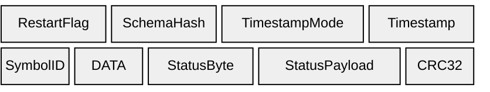

# Data

SymbolID + DATA repeat per signal. See [Elements](../elements) for field details.

## B1 — Data (`0xB1`)

Basic data: SymbolID, DATA, StatusByte, and CRC32.

---

## D1 — Data (`0xD1`)

Adds RestartFlag, TimestampMode, and Timestamp (4 bytes).

---

## D2 — Data (`0xD2`)

Adds SchemaHash and StatusPayload. Timestamp grows to 8 bytes.

