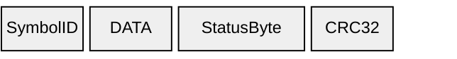
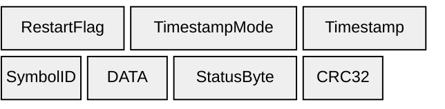
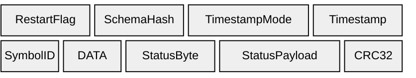

# Data

SymbolID + DATA repeat per signal. See [Elements](../elements) for field details.

## B1 — Data (`0xB1`)

Data message without timestamps.

---

## D1 — Data (`0xD1`)

Data message with 4-byte timestamps.

---

## D2 — Data (`0xD2`)

Data message with 8-byte timestamps, schema hash, and status payload.

