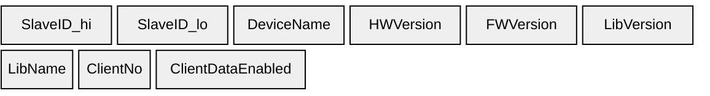
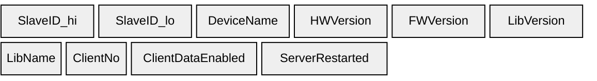
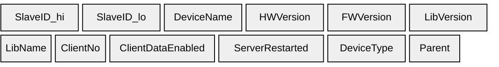

# Devices

## B2 — Devices (`0xB2`)

Device identity message.

| Element | Size | Type |
|-------|------|------|
| MasterSlaveConfig | 1 byte | uint8 |
| SlaveID | 1 byte | uint8 |
| DeviceName | variable | null-terminated string |
| HWVersion | variable | null-terminated string |
| FWVersion | variable | null-terminated string |
| LibVersion | variable | null-terminated string |

---

## B3 — Devices (`0xB3`)

Device identity message.

| Element | Size | Type |
|-------|------|------|
| MasterSlaveConfig | 1 byte | uint8 |
| SlaveID | 1 byte | uint8 |
| DeviceName | variable | null-terminated string |
| HWVersion | variable | null-terminated string |
| FWVersion | variable | null-terminated string |
| LibVersion | variable | null-terminated string |
| LibName | variable | null-terminated string |

See [Elements](../elements) for field definitions.

---

## B4 — Devices (`0xB4`)

Device identity message.

| Element | Size | Type |
|-------|------|------|
| SlaveID_hi | 1 byte | uint8 (always `0x00`) |
| SlaveID_lo | 1 byte | uint8 (always `0x00`) |
| DeviceName | variable | null-terminated string |
| HWVersion | variable | null-terminated string |
| FWVersion | variable | null-terminated string |
| LibVersion | variable | null-terminated string |
| LibName | variable | null-terminated string |
| ClientNo | variable | null-terminated string |
| ClientDataEnabled | variable | null-terminated string |

---

## B5 — Devices (`0xB5`)

Device identity message.

| Element | Size | Type |
|-------|------|------|
| SlaveID_hi | 1 byte | uint8 (always `0x00`) |
| SlaveID_lo | 1 byte | uint8 (always `0x00`) |
| DeviceName | variable | null-terminated string |
| HWVersion | variable | null-terminated string |
| FWVersion | variable | null-terminated string |
| LibVersion | variable | null-terminated string |
| LibName | variable | null-terminated string |
| ClientNo | variable | null-terminated string |
| ClientDataEnabled | variable | null-terminated string |
| ServerRestarted | variable | null-terminated string |

---

## B6 — Devices (`0xB6`)

Device identity message.

| Element | Size | Type |
|-------|------|------|
| SlaveID_hi | 1 byte | uint8 (always `0x00`) |
| SlaveID_lo | 1 byte | uint8 (always `0x00`) |
| DeviceName | variable | null-terminated string |
| HWVersion | variable | null-terminated string |
| FWVersion | variable | null-terminated string |
| LibVersion | variable | null-terminated string |
| LibName | variable | null-terminated string |
| ClientNo | variable | null-terminated string |
| ClientDataEnabled | variable | null-terminated string |
| ServerRestarted | variable | null-terminated string |
| DeviceType | variable | null-terminated string (`"server"` or `"hub"`) |
| Parent | variable | null-terminated string |
