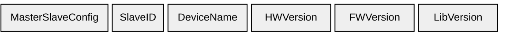
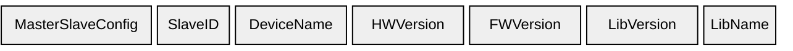
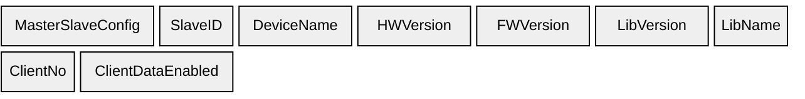
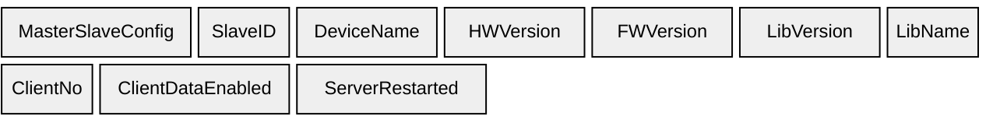
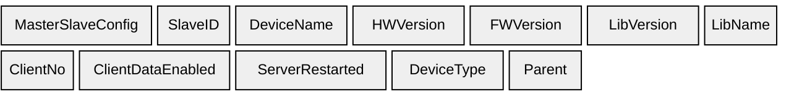

# Devices

Repeated per device. See [Elements](../elements) for field details.

## B2 — Devices (`0xB2`)

Basic device identity: name, hardware, firmware, and library version.

---

## B3 — Devices (`0xB3`)

Adds LibName.

---

## B4 — Devices (`0xB4`)

Adds ClientNo and ClientDataEnabled.

---

## B5 — Devices (`0xB5`)

Adds ServerRestarted.

---

## B6 — Devices (`0xB6`)

Adds DeviceType and Parent.

