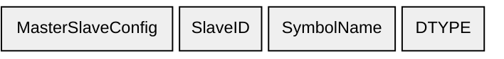

# Signals

## B0 — Symbol List (`0xB0`)

Enumerates all signals the device exposes. Sent in response to a host request.

| Element | Size | Type |
|-------|------|------|
| MasterSlaveConfig | 1 byte | uint8 |
| SlaveID | 1 byte | uint8 |
| SymbolName | variable | null-terminated string |
| DTYPE | 1 byte | uint8 |
