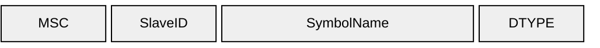

# Signals

## B0 — Symbol List (`0xB0`)

Enumerates all signals the device exposes. Sent in response to a host request.

| Element | Size | Type | Notes |
|-------|------|------|-------|
| MasterSlaveConfig | 1 byte | uint8 | `0x01` = master/local, `0x02` = slave/upstream |
| SlaveID | 1 byte | uint8 | `0x00` for master |
| SymbolName | variable | null-terminated string | Signal name |
| DTYPE | 1 byte | uint8 | [Datatype code](../datatypes) |
