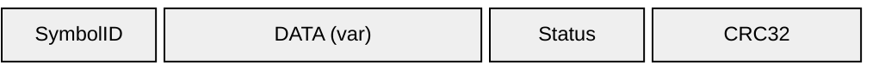
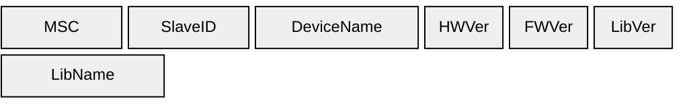
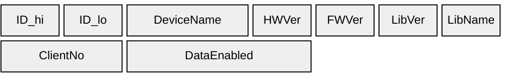
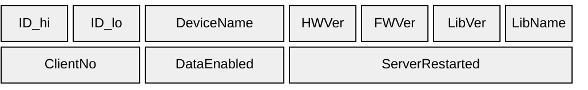
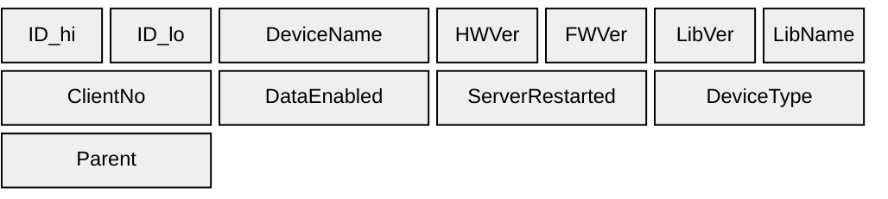
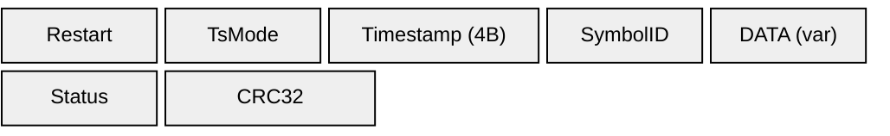
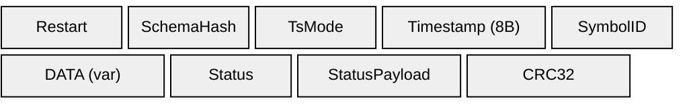

# Message Keys

The message key is a single byte in the [frame envelope](frame-format) that identifies the payload type. Keys are grouped by function:

- **B-series** — Configuration messages (symbol lists, device info)
- **C-series** — Control messages (restart notification)
- **D-series** — Data messages (signal values)

## Summary Table

| Key | Hex | Purpose |
|-----|-----|---------|
| B0 | `0xB0` | Symbol List |
| B1 | `0xB1` | Data (no timestamps) |
| B2 | `0xB2` | Devices (without LibName) |
| B3 | `0xB3` | Devices (with LibName) |
| B4 | `0xB4` | Devices (with ClientNo, ClientDataEnabled) |
| B5 | `0xB5` | Devices (with ServerRestarted) |
| B6 | `0xB6` | Devices (with DeviceType, Parent) |
| C0 | `0xC0` | Restart Notification |
| D1 | `0xD1` | Data (4-byte timestamps) |
| D2 | `0xD2` | Data (8-byte timestamps, schema hash, status payload) |

## Key Definitions

### B0 — Symbol List (`0xB0`)

Enumerates all signals the device exposes. Sent in response to a host request.

**Element layout** (repeated per signal):

| Field | Size | Type | Notes |
|-------|------|------|-------|
| **MasterSlaveConfig** | 1 byte | uint8 | `0x01` = master/local, `0x02` = slave/upstream |
| **SlaveID** | 1 byte | uint8 | `0x00` for master |
| **SymbolName** | variable | null-terminated string | Signal name |
| **DTYPE** | 1 byte | uint8 | [Datatype code](datatypes) |

---

### B1 — Data (`0xB1`)

Data message without timestamps.

**Element layout (without CRC):**

| Field | Size | Type |
|-------|------|------|
| **SymbolID** | 2 bytes | uint16 LE |
| **DATA** | variable | Per [DTYPE](datatypes) |

**Element layout (with CRC):**

| Field | Size | Type | Notes |
|-------|------|------|-------|
| **SymbolID** | 2 bytes | uint16 LE | |
| **DATA** | variable | Per [DTYPE](datatypes) | |
| StatusByte | 1 byte | uint8 | |
| CRC32 | 4 bytes | uint32 LE | Scope: MsgKey through last DATA byte (StatusByte **excluded**) |

---

### B2 — Devices (`0xB2`)

Device identity message.

**Element layout** (repeated per device):

| Field | Size | Type |
|-------|------|------|
| **MasterSlaveConfig** | 1 byte | uint8 |
| **SlaveID** | 1 byte | uint8 |
| **DeviceName** | variable | null-terminated string |
| **HWVersion** | variable | null-terminated string |
| **FWVersion** | variable | null-terminated string |
| **LibVersion** | variable | null-terminated string |

---

### B3 — Devices (`0xB3`)

Device identity message.

**Element layout** (repeated per device):

| Field | Size | Type |
|-------|------|------|
| **MasterSlaveConfig** | 1 byte | uint8 |
| **SlaveID** | 1 byte | uint8 |
| **DeviceName** | variable | null-terminated string |
| **HWVersion** | variable | null-terminated string |
| **FWVersion** | variable | null-terminated string |
| **LibVersion** | variable | null-terminated string |
| **LibName** | variable | null-terminated string |

See [Elements](elements) for field definitions.

---

### B4 — Devices (`0xB4`)

Device identity message.

**Element layout** (repeated per device):

| Field | Size | Type |
|-------|------|------|
| **SlaveID_hi** | 1 byte | uint8 (always `0x00`) |
| **SlaveID_lo** | 1 byte | uint8 (always `0x00`) |
| **DeviceName** | variable | null-terminated string |
| **HWVersion** | variable | null-terminated string |
| **FWVersion** | variable | null-terminated string |
| **LibVersion** | variable | null-terminated string |
| **LibName** | variable | null-terminated string |
| **ClientNo** | variable | null-terminated string |
| **ClientDataEnabled** | variable | null-terminated string |

---

### B5 — Devices (`0xB5`)

Device identity message.

**Element layout** (repeated per device):

| Field | Size | Type |
|-------|------|------|
| **SlaveID_hi** | 1 byte | uint8 (always `0x00`) |
| **SlaveID_lo** | 1 byte | uint8 (always `0x00`) |
| **DeviceName** | variable | null-terminated string |
| **HWVersion** | variable | null-terminated string |
| **FWVersion** | variable | null-terminated string |
| **LibVersion** | variable | null-terminated string |
| **LibName** | variable | null-terminated string |
| **ClientNo** | variable | null-terminated string |
| **ClientDataEnabled** | variable | null-terminated string |
| **ServerRestarted** | variable | null-terminated string |

---

### B6 — Devices (`0xB6`)

Device identity message.

**Element layout** (repeated per device):

| Field | Size | Type |
|-------|------|------|
| **SlaveID_hi** | 1 byte | uint8 (always `0x00`) |
| **SlaveID_lo** | 1 byte | uint8 (always `0x00`) |
| **DeviceName** | variable | null-terminated string |
| **HWVersion** | variable | null-terminated string |
| **FWVersion** | variable | null-terminated string |
| **LibVersion** | variable | null-terminated string |
| **LibName** | variable | null-terminated string |
| **ClientNo** | variable | null-terminated string |
| **ClientDataEnabled** | variable | null-terminated string |
| **ServerRestarted** | variable | null-terminated string |
| **DeviceType** | variable | null-terminated string (`"server"` or `"hub"`) |
| **Parent** | variable | null-terminated string |

---

### C0 — Restart Notification (`0xC0`)

Sent when a device restarts. Allows the host to re-request the symbol list and reset state. Payload follows the same layout as [B3](#b3--devices-0xb3):

| Field | Size | Type |
|-------|------|------|
| **MasterSlaveConfig** | 1 byte | uint8 |
| **SlaveID** | 1 byte | uint8 |
| **DeviceName** | variable | null-terminated string |
| **HWVersion** | variable | null-terminated string |
| **FWVersion** | variable | null-terminated string |
| **LibVersion** | variable | null-terminated string |
| **LibName** | variable | null-terminated string |

---

### D1 — Data (`0xD1`)

Data message with 4-byte timestamps.

**Element layout:**

| Field | Size | Type | Notes |
|-------|------|------|-------|
| RestartFlag | 1 byte | uint8 | `0x01` on first frame after restart |
| TimestampMode | 1 byte | uint8 | `0` = none, `1` = micros, `2` = RTC/UNIX |
| Timestamp | 4 bytes | uint32 LE | **Conditional:** only if TimestampMode > 0 |
| **SymbolID** | 2 bytes | uint16 LE | |
| **DATA** | variable | Per [DTYPE](datatypes) | |
| StatusByte | 1 byte | uint8 | |
| CRC32 | 4 bytes | uint32 LE | Scope: MsgKey through last DATA byte (StatusByte **excluded**) |

---

### D2 — Data (`0xD2`)

Data message with 8-byte timestamps, schema hash, and status payload.

**Element layout:**

| Field | Size | Type | Notes |
|-------|------|------|-------|
| RestartFlag | 1 byte | uint8 | `0x01` on first frame after restart |
| SchemaHash | 2 bytes | uint16 LE | [CRC16-CCITT](schema-hash) over signal schema |
| TimestampMode | 1 byte | uint8 | `0` = none, `1` = micros, `2` = UNIX |
| Timestamp | 8 bytes | uint64 LE | **Conditional:** only present if TimestampMode > 0 |
| **SymbolID** | 2 bytes | uint16 LE | Signal index |
| **DATA** | variable | — | Value bytes, size per [datatype](datatypes) |
| StatusByte | 1 byte | uint8 | [Status code](status-codes) |
| StatusPayload | 4 bytes | — | Status-specific data |
| CRC32 | 4 bytes | uint32 LE | [CRC32](crc32) over MsgKey through StatusPayload |

See [Timestamps](timestamps) for timestamp modes, [Status Codes](status-codes) for status values, and [CRC32](crc32) for the checksum algorithm.
